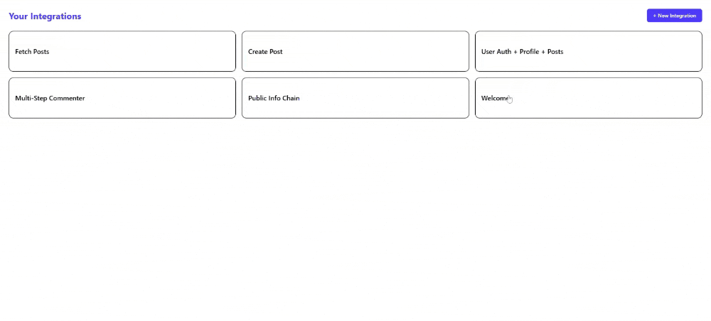
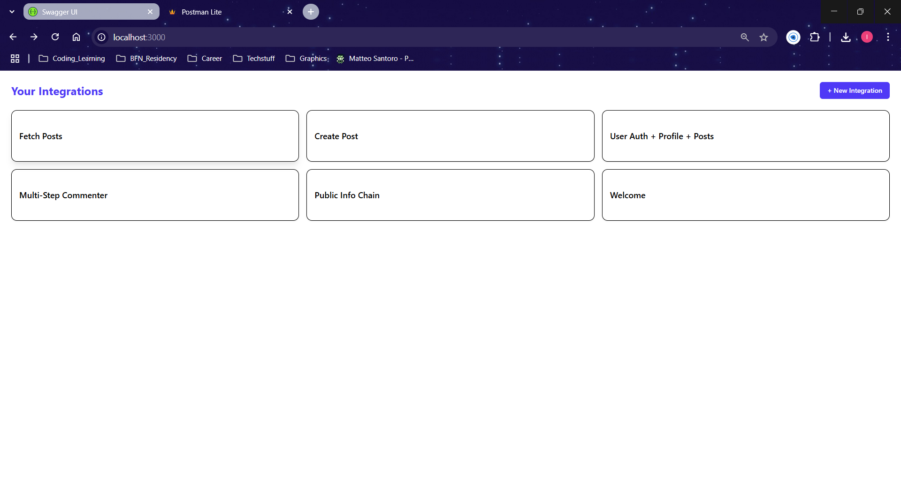
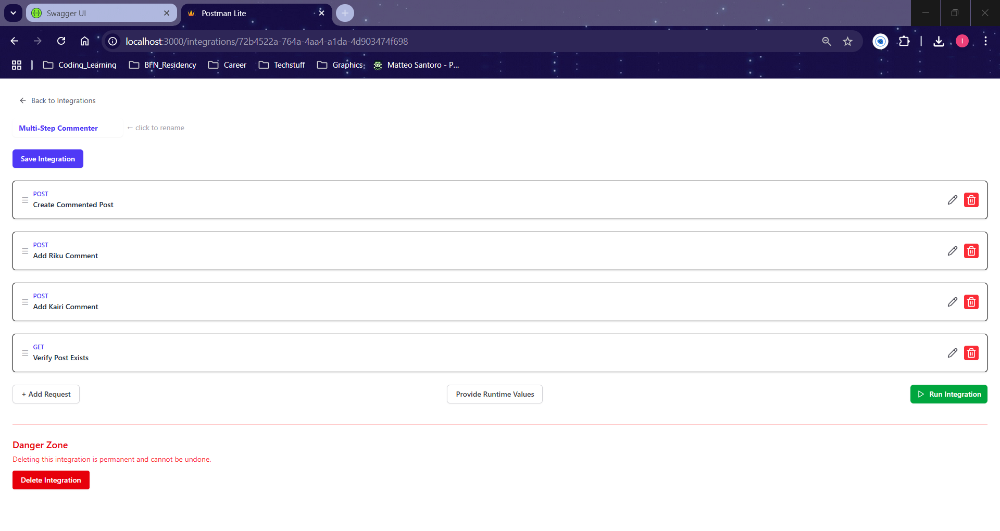

# RouteRunner

A lightweight Postman-like tool to store and run chained API calls in order. Built with **.NET 9** backend and **React + Vite + Tailwind** frontend.

## Features

- Create, edit (including rearranging requests), delete API **Integrations** (named collections of requests)
- Each request supports:
  - Method, URL, Name, headers, query params, body
  - Extractors (JSONPath-based variable extraction from previous response)
  - Runtime values to substitute placeholders like `{{userId}}`
- Run the integration sequentially
  - Displays status code, duration, success/failure, and pretty-printed response
- Add bearer token headers
- Full CORS support
- **Logs info & errors** to console
- Swagger docs available
- Unit tests
- Fully Dockerized for easy setup

---
## Demo

Here’s a quick look at PostmanLite in action:

*Exploring the site*


*List of ALL Integrations*


*List of All Requests in an Integration*


---
<!-- Add more as needed -->

> All media is stored in the `media/` folder.

## Project Structure

```
PostmanLite/
├── backend/              # .NET Core 9 API
│   ├── ApiRunner/    # Controllers, Helpers, Models and Program.cs
│   ├── ApiRunner.Tests/  # Unit + Integration Tests
├── frontend/             # React + Tailwind UI
│   └── integration-ui/
├── docker/               # nginx.conf
├── docker-compose.yml
└── README.md
```

---

## Getting Started with Docker

> ✅ Prerequisites: Docker installed

```bash
git clone https://github.com/IbukunSanni/PostmanLite.git
cd PostmanLite
docker-compose up --build
```

- Frontend: [http://localhost:3000](http://localhost:3000)
- Backend: [http://localhost:5088](http://localhost:5088)
- Swagger: [http://localhost:5088/swagger](http://localhost:5088/swagger)

---

## Run Tests

```bash
cd backend/ApiRunner.Tests
dotnet test
```

---

## Sample Integration

You can import a sample integration from `samples/sample-integration.json` or manually create one via the UI.

---

## API Docs (Swagger)

When running, visit:

```
http://localhost:5088/swagger
```

To explore the endpoints interactively.

---


## What is to come

- Authnetication
- Peristent Database
- Deployment
- Import OpenAPI specs
- OAuth 2.0 flow support
- Retry & conditional logic
- Save run logs

---

Built with ❤️ for the Valsoft 72hr Coding Challenge.

